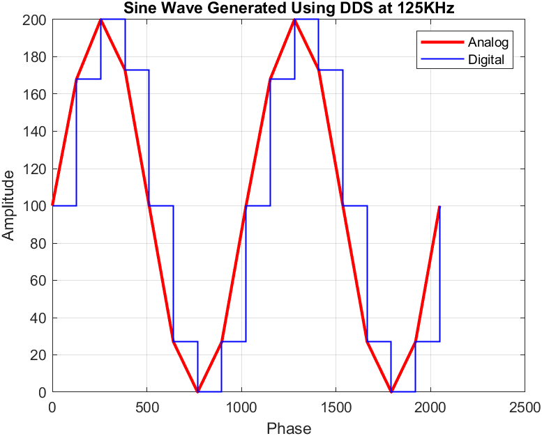

# Direct Digital Synthesizer for Sine Wave Generation
This DDS implementation generates sine waves between the range ``10KHz - 250KHz``.  

## Parameters
<ol>
<li>Clock Frequency: 1 MHz</li>
<li>Minimum Frequency Range: 1-10 KHz</li>
<li>Maximum Frequency Range: 125-250 KHz</li> 
<li>Number of Registers Allowed: 8-10</li>
<li>10-bit Digital Representation</li>
</ol>

## Architecture
The Direct Digital Synthesizer (DDS) architecture consists of key components including a phase accumulator that accumulates phase values based on the desired output frequency, a phase-to-amplitude converter mapping phase values to amplitude, and a Digital-to-Analog Converter (DAC) converting digital signals to analog waveforms. DDS systems feature frequency tuning control, clock sources driving timing components, and control interfaces enabling parameter adjustments. Output buffering and filtering stages ensure waveform conditioning for specific applications.


In this project, however, the main focus is on the phase accumulator and the phase-to-amplitude converter stages.

<!---->

<!---->
### Phase Accumulator
The phase accumulator continuously adds phase increments at a specific rate determined by the desired output frequency of the synthesized waveform. The phase increments are usually represented as fixed-point numbers (FCW). The phase values are accumulated over time and as they reach their maximum value (typically the maximum representable value of the accumulator), it wraps around to zero and continues accumulating phase values. This wrapping behavior allows the DDS to generate periodic waveforms. The phase accumulator is usually driven by a clock signal whose frequency determines the resolution and frequency resolution of the synthesized waveform. By adjusting the clock frequency or the phase increment value, the output frequency of the DDS can be controlled.

The phase accumulator module consists of a frequency register (`phase`) in which the phases are accumulated, and an FCW aka frequency control word (`increment`) that gives the constant phase value that needs to be added into the frequency register. To calculate FCWs for different frequencies, this formula was used:
```math
\text{FCW} = \frac{2^N \times \text{Desired Frequency}}{\text{Clock Frequency}}

```
where the number of bits ``N = 10``.  In this case, the maximum achievable value for the phase is ``1023`` after which the frequency register resets to zero.

### Phase-to-Amplitude Generator
The output of the phase accumulator serves as the input to a phase-to-amplitude conversion function, which maps the phase values to amplitude values based on the desired waveform shape. It is essentially a look-up table.

For this project, the sine wave look-up table values were obtained using [this](https://deepbluembedded.com/sine-lookup-table-generator-calculator/) calculator. 100 points were taken, and the signal amplitude was scaled and offset by a factor of 100. The output was: 
```
{
100, 106, 113, 119, 125, 131, 137, 143, 148, 154,
159, 164, 168, 173, 177, 181, 184, 188, 190, 193,
195, 197, 198, 199, 200, 200, 200, 199, 198, 197,
195, 193, 190, 188, 184, 181, 177, 173, 168, 164,
159, 154, 148, 143, 137, 131, 125, 119, 113, 106,
100,  94,  87,  81,  75,  69,  63,  57,  52,  46,
 41,  36,  32,  27,  23,  19,  16,  12,  10,   7,
  5,   3,   2,   1,   0,   0,   0,   1,   2,   3,
  5,   7,  10,  12,  16,  19,  23,  27,  32,  36,
 41,  46,  52,  57,  63,  69,  75,  81,  87,  94
}
```
## Implementation
The Verilog code was written and simulated using ``Xilinx Vivado v2020.1``. The file ``phase_accumulator.v`` consists of the code for the phase accumulator and the file ``phase_to_amplitude_converter.v`` consists of the look-up table/ranges used to map a given phase to its amplitude. These modules were then cascaded using the top-level module, ``sine_wave_generator.v``, as shown in the schematic below:


``testbench.v`` is the testbench used to simulate the top-level module and obtain the waveforms. The results of this simulation were dumped into the TCL console and subsequently stored in a ``.txt`` file. Then, the results from that file were read and visualized using the ``MATLAB`` script, ``sine_wave_display.m``.
## Results
The results obtained when the desired frequency was set to ``125KHz`` were:
```
Time:              1500000, Phase:    0, Data_sin:  100
Time:              2500000, Phase:  128, Data_sin:  168
Time:              3500000, Phase:  256, Data_sin:  200
Time:              4500000, Phase:  384, Data_sin:  173
Time:              5500000, Phase:  512, Data_sin:  100
Time:              6500000, Phase:  640, Data_sin:   27
Time:              7500000, Phase:  768, Data_sin:    0
Time:              8500000, Phase:  896, Data_sin:   27
Time:              9500000, Phase:    0, Data_sin:  100
```
It can be observed how the phase resets to 0 when the frequency register exceeds the maximum achievable value. The sine wave plotted using these values is shown below ([original logs](results/original/logs-125KHz.txt), [logs used for plotting](<results/for MATLAB/logs-125KHz.txt>)):



Similarly, for a frequency of ``250KHz``, the output can be seen below ([original logs](results/original/logs-250KHz.txt), [logs used for plotting](<results/for MATLAB/logs-125KHz.txt>)):


The wave for the highest resolution was obtained for the frequency ``10KHz`` as seen in the plot below. The file read to plot this can be found [here](results/original/logs-10KHz.txt).


--- 

All of the code in this repository is written by [Samiya Ali Zaidi](https://github.com/samiyaalizaidi). 
